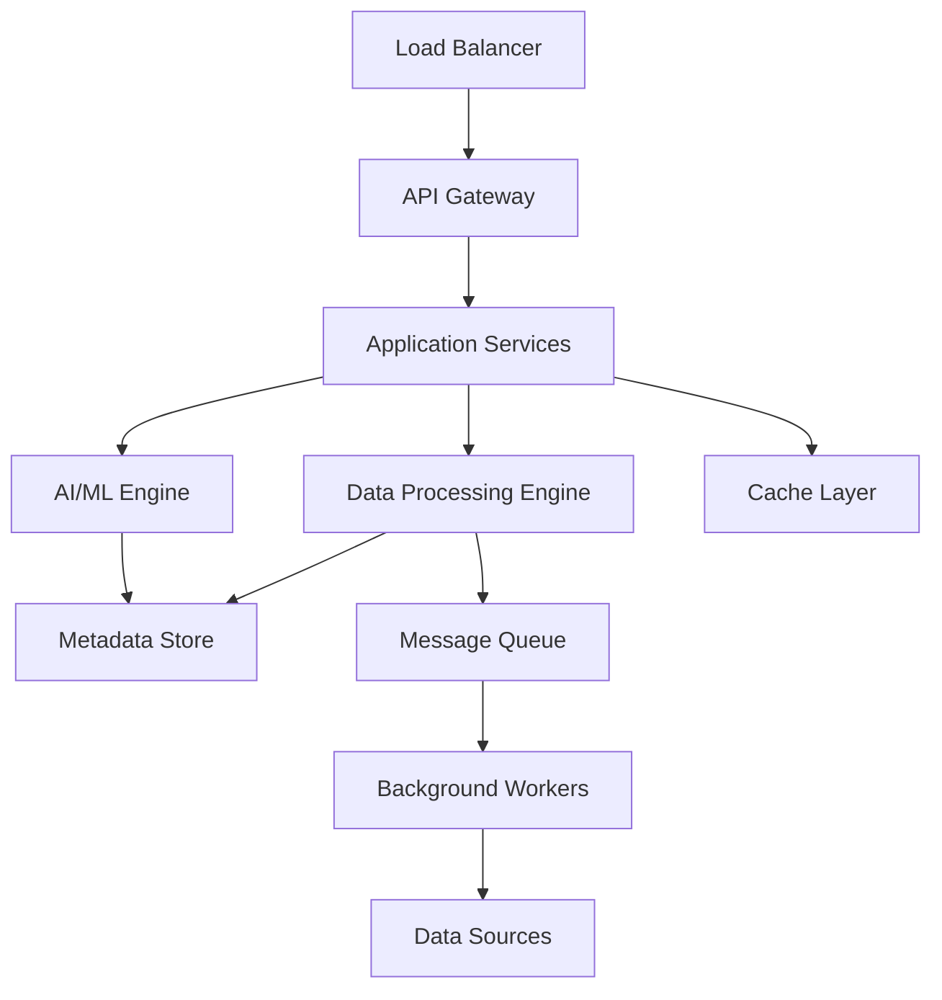

## System Architecture

AVA is built on a modern, cloud-native architecture designed for scalability, security, and performance.

## Core Components

<CardGroup cols={2}>
  <Card title="API Gateway" icon="door-open">
    Authentication, rate limiting, routing
  </Card>
  <Card title="Application Services" icon="server">
    Business logic and orchestration
  </Card>
  <Card title="Data Processing" icon="gears">
    Discovery, classification, lineage
  </Card>
  <Card title="AI/ML Engine" icon="brain">
    Classification, anomaly detection, search
  </Card>
</CardGroup>

## Infrastructure Requirements

### Minimum Requirements (Production)

<Tabs>
  <Tab title="Compute">
    - **API Services**: 4 vCPU, 8 GB RAM
    - **Workers**: 8 vCPU, 16 GB RAM
    - **Database**: 4 vCPU, 16 GB RAM
    - **Cache**: 2 vCPU, 4 GB RAM
  </Tab>

  <Tab title="Storage">
    - **Database**: 500 GB SSD
    - **Object Storage**: 1 TB+
    - **Logs**: 100 GB
  </Tab>

  <Tab title="Network">
    - **Bandwidth**: 1 Gbps
    - **Load Balancer**: Layer 7
    - **TLS Termination**: Required
  </Tab>
</Tabs>

## Deployment Models

<CardGroup cols={2}>
  <Card title="Cloud (SaaS)" icon="cloud">
    Fully managed by DataRM
    - Fastest deployment
    - Automatic updates
    - 99.9% SLA
  </Card>
  <Card title="Self-Hosted" icon="server">
    Deploy in your infrastructure
    - Full control
    - Data stays in your environment
    - Customizable
  </Card>
</CardGroup>

## Security Architecture

- **Zero-trust model**: All requests authenticated and authorized
- **Encryption**: AES-256 at rest, TLS 1.3 in transit
- **Network isolation**: Services in private networks
- **Secret management**: HashiCorp Vault integration
- **Audit logging**: Complete audit trail

## Next Steps

<CardGroup cols={2}>
  <Card title="Self-Hosted Deployment" icon="server" href="/deployment/self-hosted">
    Deploy AVA in your environment
  </Card>
  <Card title="Cloud Deployment" icon="cloud" href="/deployment/cloud-deployment">
    Use AVA Cloud
  </Card>
  <Card title="Security" icon="shield" href="/deployment/security">
    Security best practices
  </Card>
  <Card title="Scalability" icon="chart-line" href="/deployment/scalability">
    Scaling AVA for enterprise
  </Card>
</CardGroup>
