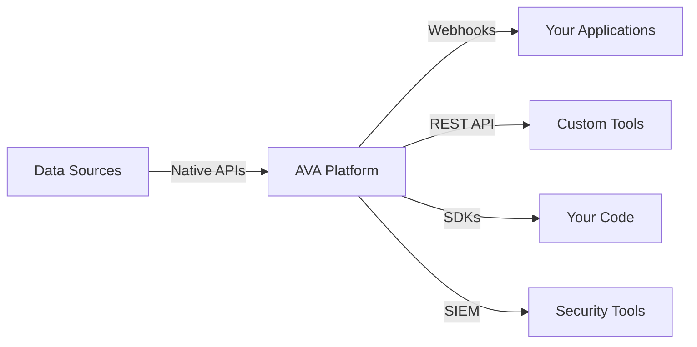

## Architecture Overview

AVA operates on a modern, cloud-native architecture designed for enterprise scale and security.

## Core Components

<CardGroup cols={2}>
  <Card title="Discovery Engine" icon="radar">
    Continuously scans and catalogs data across all connected sources
  </Card>
  <Card title="AI Classification Engine" icon="brain">
    Machine learning models identify and classify sensitive data
  </Card>
  <Card title="Risk Scoring Engine" icon="shield-halved">
    Evaluates risk based on multiple factors and context
  </Card>
  <Card title="Policy Engine" icon="gavel">
    Enforces governance rules and access controls
  </Card>
</CardGroup>

## Data Discovery Workflow

<Steps>
  <Step title="Connection">
    AVA connects securely to your data sources via native APIs
  </Step>
  <Step title="Scanning">
    Metadata is extracted without copying or moving actual data
  </Step>
  <Step title="Cataloging">
    Assets are indexed in AVA's searchable data catalog
  </Step>
  <Step title="Continuous Monitoring">
    Changes are detected and catalog is updated automatically
  </Step>
</Steps>

## AI Classification

AVA uses advanced machine learning to classify data:

<Accordion title="Pattern Recognition">
  Identifies data patterns like email addresses, phone numbers, credit cards
</Accordion>
<Accordion title="Context Analysis">
  Understands field names, table structures, and relationships
</Accordion>
<Accordion title="Content Analysis">
  Analyzes sample data to infer sensitivity levels
</Accordion>
<Accordion title="Custom Training">
  Learns from your feedback to improve accuracy over time
</Accordion>

## Risk Assessment

AVA calculates risk scores based on:

- **Data Sensitivity**: PII, PHI, financial data receive higher risk scores
- **Access Patterns**: Who has access and how data is being used
- **Compliance Requirements**: Regulatory obligations tied to data types
- **Security Posture**: Encryption, access controls, audit logging
- **Historical Incidents**: Past security events and violations

## Policy Enforcement

<Tabs>
  <Tab title="Access Control">
    Define who can access what data based on roles, attributes, and context
  </Tab>
  <Tab title="Data Retention">
    Automatically enforce retention policies and deletion schedules
  </Tab>
  <Tab title="Usage Monitoring">
    Track how data is accessed and used across your organization
  </Tab>
  <Tab title="Compliance Rules">
    Enforce GDPR, CCPA, HIPAA, and other regulatory requirements
  </Tab>
</Tabs>

## Integration Methods

AVA integrates with your ecosystem through:

## Security & Privacy

<Info>
  AVA is built on zero-trust security principles with end-to-end encryption.
</Info>

- **Data Never Leaves Your Environment**: Only metadata is processed
- **Encrypted Transit**: All communications use TLS 1.3+
- **Encrypted at Rest**: Data catalog encrypted with AES-256
- **Role-Based Access**: Granular permissions for all users
- **Audit Logging**: Complete audit trail of all actions

## Next Steps

<CardGroup cols={2}>
  <Card title="Key Features" icon="star" href="/essentials/key-features">
    Explore AVA's full capabilities
  </Card>
  <Card title="Get Started" icon="rocket" href="/quickstart">
    Start using AVA today
  </Card>
</CardGroup>
