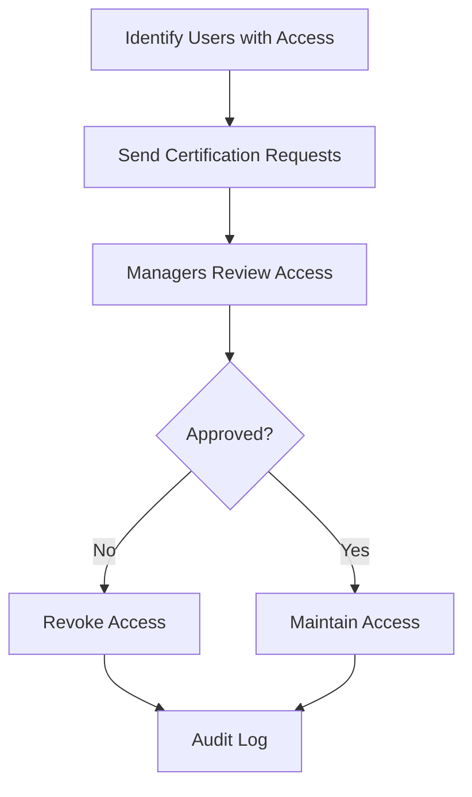

## Industry Use Cases

### Financial Services

<AccordionGroup>
  <Accordion title="Customer Data Protection">
    **Challenge**: Banks handle sensitive customer financial data across hundreds of systems

    **Solution**: AVA automatically discovers and classifies customer PII, account numbers, and transaction data. Enforces access controls and monitors for unauthorized access.

    **Results**:
    - 99.9% accuracy in PII detection
    - 60% reduction in data breach risk
    - Automated SOX compliance reporting
  </Accordion>

  <Accordion title="Fraud Detection">
    **Challenge**: Detect unusual access patterns that might indicate fraud or insider threats

    **Solution**: AVA's anomaly detection identifies suspicious behavior like bulk data downloads, unusual query patterns, or after-hours access.

    **Results**:
    - 85% faster threat detection
    - 40% reduction in false positives
    - Automated incident response workflows
  </Accordion>

  <Accordion title="Regulatory Compliance">
    **Challenge**: Meet SOX, PCI-DSS, and regional banking regulations

    **Solution**: Automated compliance monitoring, evidence collection, and audit-ready reports

    **Results**:
    - 70% faster audit preparation
    - Complete audit trails for all data access
    - Automated policy enforcement
  </Accordion>
</AccordionGroup>

### Healthcare

<CardGroup cols={2}>
  <Card title="HIPAA Compliance" icon="hospital">
    Automatically identify and protect PHI across EHR systems, databases, and file shares
  </Card>
  <Card title="Patient Privacy" icon="user-shield">
    Monitor who accesses patient records and ensure minimum necessary access
  </Card>
  <Card title="Research Data" icon="flask">
    Manage de-identification and anonymization for research projects
  </Card>
  <Card title="Vendor Management" icon="handshake">
    Control third-party access to patient data and track BAA compliance
  </Card>
</CardGroup>

### Retail & E-Commerce

<Tabs>
  <Tab title="Customer PII Protection">
    - Discover customer data across CRM, databases, and analytics platforms
    - Classify email addresses, phone numbers, payment info automatically
    - Enforce GDPR and CCPA data subject rights
    - Track consent and opt-out preferences
  </Tab>
  <Tab title="PCI-DSS Compliance">
    - Locate all cardholder data across your environment
    - Validate encryption and access controls
    - Monitor for policy violations
    - Generate compliance reports for auditors
  </Tab>
  <Tab title="Marketing Analytics">
    - Ensure customer data is used appropriately in marketing
    - Track data sharing with third-party platforms
    - Manage cookie consent and tracking
    - Monitor data retention policies
  </Tab>
</Tabs>

### Technology & SaaS

**Scenario**: SaaS company needs SOC 2 Type II certification

<Steps>
  <Step title="Data Inventory">
    AVA catalogs all customer data across production systems
  </Step>
  <Step title="Access Controls">
    Implements RBAC and enforces least privilege access
  </Step>
  <Step title="Monitoring">
    Continuous monitoring of data access and system changes
  </Step>
  <Step title="Evidence Collection">
    Automated collection of audit evidence for SOC 2 controls
  </Step>
  <Step title="Audit Support">
    Generate reports and documentation for auditors
  </Step>
</Steps>

<Check>
  **Result**: Achieved SOC 2 Type II certification 50% faster than industry average
</Check>

## Functional Use Cases

### Data Discovery Projects

<CardGroup cols={2}>
  <Card title="Cloud Migration" icon="cloud-arrow-up">
    Discover all data before cloud migration to ensure nothing is left behind
  </Card>
  <Card title="M&A Due Diligence" icon="building">
    Quickly assess data assets and risks during acquisitions
  </Card>
  <Card title="Data Cleanup" icon="broom">
    Identify and remove redundant, obsolete, or trivial data (ROT)
  </Card>
  <Card title="Shadow IT Discovery" icon="eye">
    Find unsanctioned data stores and SaaS applications
  </Card>
</CardGroup>

### Privacy & Compliance

<AccordionGroup>
  <Accordion title="GDPR Data Subject Requests">
    Quickly locate all data related to a specific individual across your entire organization for:
    - Right to access requests
    - Right to erasure (right to be forgotten)
    - Data portability requests
    - Consent withdrawal
  </Accordion>

  <Accordion title="Data Retention Enforcement">
    Automatically enforce data retention policies:
    - Identify data past retention period
    - Automate deletion workflows
    - Document deletions for compliance
    - Handle legal holds and exceptions
  </Accordion>

  <Accordion title="Breach Response">
    Rapid response to data breaches:
    - Identify scope of compromised data
    - Locate all affected individuals
    - Generate breach notification lists
    - Document incident for regulators
  </Accordion>
</AccordionGroup>

### Risk Management

**Access Recertification Campaign**



**Risk-Based Monitoring**

Focus security resources on highest-risk assets:
1. AVA scores all data assets by risk
2. Critical assets receive enhanced monitoring
3. Alerts trigger for any access to high-risk data
4. Automated workflows for investigation

### Developer Workflows

<Tabs>
  <Tab title="API Integration">
    ```python
    # Integrate AVA into your data pipeline
    from ava import Client

    client = Client(api_key="YOUR_API_KEY")

    # Check if data contains PII before processing
    classification = client.classify(data_sample)
    if classification.contains_pii:
        # Apply additional security controls
        encrypt_data(data_sample)
    ```
  </Tab>
  <Tab title="CI/CD Pipeline">
    ```yaml
    # GitHub Actions workflow
    - name: AVA Data Scan
      run: |
        ava scan --source production-db \
                 --fail-on-risk critical \
                 --report-format json
    ```
  </Tab>
  <Tab title="Custom Dashboards">
    ```javascript
    // Build custom dashboards with AVA API
    const metrics = await ava.metrics.get({
      timeRange: 'last-30-days',
      groupBy: 'data-source'
    });

    renderChart(metrics);
    ```
  </Tab>
</Tabs>

## Common Workflows

### Weekly Access Review

1. AVA identifies all users with data access
2. Sends certification requests to data owners
3. Data owners approve or revoke access
4. AVA automatically updates permissions
5. Generates compliance report

### Incident Investigation

1. Security team receives alert about unusual access
2. AVA shows complete audit trail
3. Identifies all affected data assets
4. Provides risk assessment
5. Enables one-click remediation

### Compliance Reporting

1. Select compliance framework (GDPR, HIPAA, etc.)
2. Choose reporting period
3. AVA generates comprehensive report with:
   - Control status
   - Policy violations
   - Remediation actions
   - Audit evidence

## Next Steps

<CardGroup cols={2}>
  <Card
    title="Get Started"
    icon="rocket"
    href="/quickstart"
  >
    Try AVA with your own data
  </Card>
  <Card
    title="Request Demo"
    icon="calendar"
    href="https://datarm.com/demo"
  >
    See these use cases in action
  </Card>
  <Card
    title="Installation Guide"
    icon="download"
    href="/getting-started/installation"
  >
    Install AVA in your environment
  </Card>
  <Card
    title="API Reference"
    icon="code"
    href="/api-reference/introduction"
  >
    Build custom integrations
  </Card>
</CardGroup>
