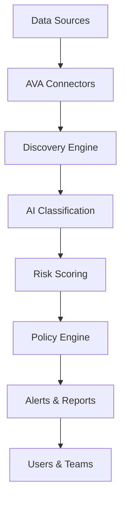

## Overview

AVA (AI Virtual Assistant) by DataRM is an enterprise-grade platform that transforms how organizations approach data governance, risk management, and compliance. Built on cutting-edge AI technology, AVA automates the complex tasks of data discovery, classification, access control, and compliance monitoring.

## The Problem AVA Solves

Modern enterprises face critical challenges:

<AccordionGroup>
  <Accordion title="Data Sprawl">
    Data exists across hundreds of systems - cloud platforms, databases, SaaS applications, and file shares. Organizations struggle to maintain visibility and control.
  </Accordion>
  <Accordion title="Compliance Complexity">
    Regulations like GDPR, CCPA, SOC2, and HIPAA require continuous monitoring and evidence collection. Manual compliance is time-consuming and error-prone.
  </Accordion>
  <Accordion title="Security Risks">
    Sensitive data (PII, PHI, financial data) is often unprotected or accessible to unauthorized users, creating security vulnerabilities.
  </Accordion>
  <Accordion title="Lack of Visibility">
    Organizations don't know what data they have, where it is, who has access, or how it's being used.
  </Accordion>
</AccordionGroup>

## How AVA Works

AVA provides an intelligent, automated solution:

<Steps>
  <Step title="Discover">
    Automatically scans and catalogs data across all connected systems
  </Step>
  <Step title="Classify">
    Uses AI to identify and tag sensitive data types (PII, PHI, financial, etc.)
  </Step>
  <Step title="Assess">
    Evaluates risk based on sensitivity, access patterns, and compliance requirements
  </Step>
  <Step title="Protect">
    Enforces access controls and governance policies automatically
  </Step>
  <Step title="Monitor">
    Continuously tracks compliance status and alerts on policy violations
  </Step>
</Steps>

## Core Capabilities

### Data Governance

<CardGroup cols={2}>
  <Card title="Automated Discovery" icon="magnifying-glass">
    Find all data assets across your organization automatically
  </Card>
  <Card title="Smart Classification" icon="tags">
    AI-powered identification of sensitive data types
  </Card>
  <Card title="Access Control" icon="key">
    Role-based permissions and policy enforcement
  </Card>
  <Card title="Audit Trails" icon="list-check">
    Complete audit logs for compliance and security
  </Card>
</CardGroup>

### Risk Management

<CardGroup cols={2}>
  <Card title="Risk Scoring" icon="gauge-high">
    AI-driven risk assessment for all data assets
  </Card>
  <Card title="Real-time Alerts" icon="bell">
    Immediate notifications for policy violations
  </Card>
  <Card title="Anomaly Detection" icon="chart-line">
    Identify unusual access patterns and behaviors
  </Card>
  <Card title="Compliance Reports" icon="file-chart-column">
    Automated reporting for auditors and regulators
  </Card>
</CardGroup>

## Who Uses AVA?

AVA serves diverse teams across your organization:

<Tabs>
  <Tab title="Data Teams">
    **Data Governance Officers** use AVA to:
    - Maintain a complete data catalog
    - Enforce governance policies
    - Ensure compliance across systems
    - Track data lineage and usage
  </Tab>
  <Tab title="Security Teams">
    **Chief Information Security Officers** use AVA to:
    - Identify and protect sensitive data
    - Monitor access patterns
    - Detect security threats
    - Respond to incidents quickly
  </Tab>
  <Tab title="Compliance Teams">
    **Compliance Officers** use AVA to:
    - Automate compliance monitoring
    - Generate audit reports
    - Track regulatory changes
    - Demonstrate compliance to auditors
  </Tab>
  <Tab title="IT Teams">
    **IT Administrators** use AVA to:
    - Manage data source connections
    - Configure integrations
    - Monitor system health
    - Troubleshoot issues
  </Tab>
</Tabs>

## Key Differentiators

What makes AVA unique:

| Feature | Traditional Tools | AVA |
|---------|------------------|-----|
| **Data Discovery** | Manual, scheduled scans | Continuous, AI-powered discovery |
| **Classification** | Rule-based patterns | Machine learning classification |
| **Risk Assessment** | Static risk scores | Dynamic, context-aware scoring |
| **Compliance** | Periodic audits | Real-time monitoring |
| **Deployment** | Weeks to months | Minutes to hours |
| **Scalability** | Limited to specific systems | Enterprise-scale, cross-platform |

## Industry Applications

<CardGroup cols={2}>
  <Card title="Financial Services" icon="building-columns">
    Protect customer financial data, ensure SOX compliance, prevent fraud
  </Card>
  <Card title="Healthcare" icon="hospital">
    Secure PHI, maintain HIPAA compliance, manage patient privacy
  </Card>
  <Card title="Retail & E-commerce" icon="cart-shopping">
    Protect customer PII, ensure PCI-DSS compliance, prevent data breaches
  </Card>
  <Card title="Technology & SaaS" icon="laptop-code">
    Manage customer data, demonstrate SOC2 compliance, scale governance
  </Card>
</CardGroup>

## Technical Architecture

AVA is built on modern, cloud-native architecture:

<Info>
  Learn more about AVA's architecture in our [deployment guide](/deployment/architecture).
</Info>

## Getting Started

Ready to transform your data governance?

<CardGroup cols={2}>
  <Card
    title="Quick Start"
    icon="rocket"
    href="/quickstart"
  >
    Get up and running in 5 minutes
  </Card>
  <Card
    title="Request Demo"
    icon="calendar"
    href="https://datarm.com/demo"
  >
    See AVA in action with your data
  </Card>
</CardGroup>

## Next Steps

<CardGroup cols={3}>
  <Card title="How It Works" icon="gears" href="/essentials/how-it-works">
    Deep dive into AVA's technology
  </Card>
  <Card title="Key Features" icon="star" href="/essentials/key-features">
    Explore all capabilities
  </Card>
  <Card title="Use Cases" icon="briefcase" href="/essentials/use-cases">
    Real-world applications
  </Card>
</CardGroup>
