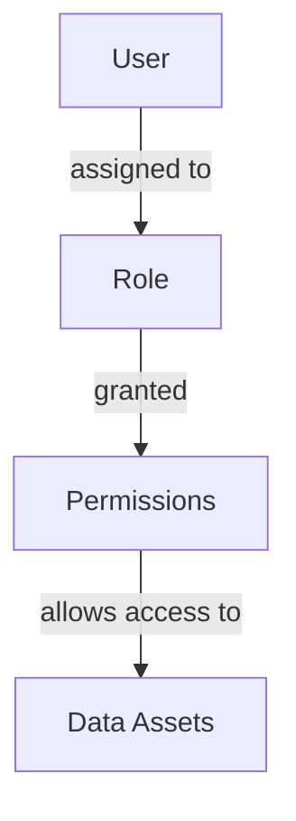

## Overview

AVA provides enterprise-grade access control mechanisms to ensure data is accessible only to authorized users. Implement fine-grained permissions, dynamic access policies, and Just-In-Time (JIT) access to protect sensitive information.

<CardGroup cols={2}>
  <Card title="RBAC" icon="users-gear">
    Role-Based Access Control for consistent permissions
  </Card>
  <Card title="ABAC" icon="shield-halved">
    Attribute-Based Access for dynamic policies
  </Card>
  <Card title="JIT Access" icon="clock">
    Temporary elevated permissions on demand
  </Card>
  <Card title="Data Masking" icon="eye-slash">
    Protect sensitive data in non-production environments
  </Card>
</CardGroup>

## Role-Based Access Control (RBAC)

### Understanding RBAC

RBAC assigns permissions based on user roles within your organization:



### Creating Access Control Policies

<Tabs>
  <Tab title="Via Dashboard">
    <Steps>
      <Step title="Navigate to Policies">
        Go to **Governance** > **Access Policies** > **Create Policy**
      </Step>
      <Step title="Define Scope">
        Select data sources, classifications, or specific assets
      </Step>
      <Step title="Set Permissions">
        Choose allowed actions: read, write, query, export, etc.
      </Step>
      <Step title="Assign Roles">
        Select which roles the policy applies to
      </Step>
      <Step title="Activate Policy">
        Review and enable the policy
      </Step>
    </Steps>
  </Tab>

  <Tab title="Via CLI">
    ```bash
    # Create access policy
    ava policies create-access \
      --name "Finance Data Access" \
      --scope "classification:FINANCIAL,source:snowflake_finance" \
      --roles "finance-analyst,finance-manager" \
      --permissions "read,query" \
      --require-mfa \
      --audit-all-access

    # List all access policies
    ava policies list --type access

    # Apply policy
    ava policies apply finance-data-access --enforce
    ```
  </Tab>

  <Tab title="Via API">
    ```python
    from ava import Client

    client = Client(api_key="YOUR_API_KEY")

    # Create access policy
    policy = client.policies.create_access_policy(
        name="Finance Data Access",
        scope={
            "classifications": ["FINANCIAL", "PII_FINANCIAL"],
            "sources": ["snowflake_finance"]
        },
        permissions=["read", "query"],
        roles=["finance-analyst", "finance-manager"],
        conditions={
            "require_mfa": True,
            "allowed_ip_ranges": ["10.0.0.0/8"],
            "time_restrictions": {
                "days": ["monday", "tuesday", "wednesday", "thursday", "friday"],
                "hours": "08:00-18:00"
            }
        },
        enforcement="strict"
    )
    ```
  </Tab>
</Tabs>

## Attribute-Based Access Control (ABAC)

### Dynamic Access Policies

ABAC evaluates user, resource, and environmental attributes:

```yaml
# Example: Regional data access policy
policy:
  name: Regional Sales Data Access
  description: Users can only access sales data from their region

  subject_attributes:
    user.department: "Sales"
    user.region: ["US-WEST", "US-EAST", "EMEA", "APAC"]
    user.employment_type: "full-time"

  resource_attributes:
    data.classification: "SALES_DATA"
    data.region: "${user.region}"  # Must match user's region
    data.sensitivity: ["low", "medium"]

  environmental_attributes:
    request.time: "business_hours"
    request.location: "corporate_network"

  actions:
    - read
    - query
    - export  # Only if user.level >= "manager"

  conditions:
    - user.region == data.region
    - data.sensitivity != "high" OR user.clearance_level >= 3
    - request.location == "corporate_network" OR user.mfa_verified == true
```

### Implementing ABAC

```bash
# Create ABAC policy
ava policies create-abac \
  --name "Regional Sales Access" \
  --config regional-access-policy.yaml

# Test policy against user
ava policies test \
  --policy "Regional Sales Access" \
  --user john@company.com \
  --resource salesforce_west_accounts \
  --action query
```

## Row-Level Security (RLS)

Restrict data access at the row level:

### Configure RLS Policies

<Tabs>
  <Tab title="Simple Filter">
    ```bash
    # Users only see their own department's data
    ava security create-rls \
      --name "Department Data Isolation" \
      --source snowflake_prod \
      --table employees \
      --filter "department = {{user.department}}" \
      --roles "manager,analyst"
    ```
  </Tab>

  <Tab title="Complex Filter">
    ```python
    # Multi-condition RLS
    rls_policy = client.security.create_rls_policy(
        name="Sales Territory Access",
        source="salesforce",
        table="opportunities",
        filter_expression="""
            (territory_id = {{user.territory_id}})
            OR (assigned_to = {{user.email}})
            OR ({{user.role}} = 'sales-director')
        """,
        roles=["sales-rep", "sales-manager"]
    )
    ```
  </Tab>

  <Tab title="Dynamic Filter">
    ```sql
    -- Filter based on multiple user attributes
    CREATE RLS POLICY manager_team_access ON employees
    FOR SELECT
    USING (
        manager_email = current_user_email()
        OR employee_id = current_user_id()
        OR current_user_has_role('hr-admin')
    )
    ```
  </Tab>
</Tabs>

### Testing RLS Policies

```bash
# Test RLS for specific user
ava security test-rls \
  --policy "Department Data Isolation" \
  --user john@company.com \
  --show-accessible-rows

# Verify RLS is applied
ava security verify-rls \
  --source snowflake_prod \
  --table employees
```

## Column-Level Security (CLS)

Protect sensitive columns from unauthorized access:

### Hide Sensitive Columns

```bash
# Hide columns from specific roles
ava security hide-columns \
  --source salesforce \
  --table accounts \
  --columns "revenue,credit_score,ssn" \
  --except-roles "finance-admin,compliance-officer"
```

### Column Masking

<Tabs>
  <Tab title="Email Masking">
    ```bash
    ava security mask-column \
      --source snowflake_prod \
      --table customers \
      --column email \
      --mask-type email \
      --roles "developer,analyst"

    # Result: john.doe@example.com → j***@example.com
    ```
  </Tab>

  <Tab title="Phone Masking">
    ```bash
    ava security mask-column \
      --source salesforce \
      --table contacts \
      --column phone \
      --mask-type phone

    # Result: (555) 123-4567 → (555) ***-****
    ```
  </Tab>

  <Tab title="Custom Masking">
    ```python
    # Custom masking function
    client.security.create_masking_rule(
        name="SSN Masking",
        source="hr_database",
        table="employees",
        column="ssn",
        mask_function=lambda ssn: f"***-**-{ssn[-4:]}",
        roles=["hr-analyst"]
    )
    # Result: 123-45-6789 → ***-**-6789
    ```
  </Tab>

  <Tab title="Conditional Masking">
    ```yaml
    masking_rule:
      name: Conditional Email Masking
      table: users
      column: email
      conditions:
        - if: user.department != data.owner_department
          then: mask_email
        - if: user.role == "admin"
          then: no_mask
        - default: mask_email
    ```
  </Tab>
</Tabs>

## Just-In-Time (JIT) Access

Grant temporary elevated permissions:

### Request JIT Access

```bash
# User requests temporary access
ava access request-jit \
  --resource customer_financial_data \
  --duration 4h \
  --reason "Investigate billing issue #12345" \
  --approver finance-team@company.com
```

### Approve JIT Requests

<Steps>
  <Step title="Review Request">
    Approver receives notification with request details
  </Step>
  <Step title="Verify Justification">
    Check that reason is legitimate and specific
  </Step>
  <Step title="Approve with Limits">
    ```bash
    ava access approve-jit req_abc123 \
      --duration 2h \
      --max-queries 100 \
      --audit-all-actions \
      --notify-on-completion
    ```
  </Step>
  <Step title="Automatic Revocation">
    Access automatically expires after specified duration
  </Step>
</Steps>

### Configure JIT Policies

```yaml
jit_policy:
  name: Production Database JIT Access
  resources:
    - production_databases
    - customer_pii_tables

  approval_requirements:
    approvers:
      - database-admin-team
      - security-team
    minimum_approvals: 2
    approval_timeout: 30m

  constraints:
    max_duration: 8h
    allowed_actions: ["read", "query"]
    require_reason: true
    require_ticket_reference: true

  monitoring:
    audit_all_actions: true
    alert_on_export: true
    record_all_queries: true
    notify_on_expiration: true
```

## Breakglass Access

Emergency access for critical situations:

```bash
# Enable breakglass access
ava access breakglass enable \
  --user oncall-engineer@company.com \
  --resource production_systems \
  --duration 1h \
  --reason "P0 incident: service outage" \
  --incident-id "INC-2024-1234" \
  --notify "security-team@company.com"
```

<Warning>
  Breakglass access bypasses normal approval workflows. All actions are heavily audited and reviewed.
</Warning>

## Access Request Workflows

### Self-Service Access Requests

Enable users to request access with automated workflows:

```yaml
access_request_workflow:
  name: Standard Data Access Request

  steps:
    - name: User Submits Request
      required_fields:
        - resource
        - business_justification
        - duration
        - manager_approval: true

    - name: Automated Checks
      validations:
        - user_has_completed_training
        - user_has_signed_ndａ
        - resource_exists
        - request_within_policy

    - name: Manager Approval
      if: required
      timeout: 2 business_days

    - name: Data Owner Approval
      if: resource.sensitivity >= "high"
      timeout: 2 business_days

    - name: Grant Access
      actions:
        - assign_temporary_role
        - notify_user
        - schedule_review
        - create_audit_entry

    - name: Periodic Review
      schedule: every 30 days
      action: request_reapproval
```

## Monitoring Access

### Real-Time Access Monitoring

```bash
# Monitor active sessions
ava access monitor --real-time

# Alert on suspicious access patterns
ava access configure-alerts \
  --unusual-time \
  --unusual-location \
  --bulk-export \
  --failed-attempts threshold:5
```

### Access Analytics

<Tabs>
  <Tab title="Access Reports">
    ```bash
    # Generate access report
    ava reports access-summary \
      --period last-30-days \
      --group-by user,resource,action

    # Show privileged access
    ava reports privileged-access \
      --min-risk-score 70
    ```
  </Tab>

  <Tab title="Access Patterns">
    ```python
    # Analyze access patterns
    patterns = client.analytics.access_patterns(
        period="30d",
        detect_anomalies=True
    )

    for anomaly in patterns.anomalies:
        print(f"Unusual access: {anomaly.user} → {anomaly.resource}")
        print(f"  Reason: {anomaly.reason}")
        print(f"  Risk Score: {anomaly.risk_score}")
    ```
  </Tab>

  <Tab title="Compliance Dashboard">
    ```bash
    # Access compliance metrics
    ava dashboard access-compliance \
      --show-violations \
      --show-exceptions \
      --export compliance-report.pdf
    ```
  </Tab>
</Tabs>

## Access Certification

Periodic review and certification of access rights:

```bash
# Start access certification campaign
ava certification start \
  --name "Q4 2024 Access Review" \
  --scope "all-users" \
  --reviewers "managers" \
  --deadline 2024-12-31 \
  --auto-revoke-on-no-response

# Check certification status
ava certification status "Q4 2024 Access Review"

# Export results
ava certification export "Q4 2024 Access Review" \
  --format excel \
  --include-approvals
```

## Best Practices

<CardGroup cols={2}>
  <Card title="Least Privilege" icon="shield-check">
    Grant minimum permissions necessary for job function
  </Card>
  <Card title="Regular Reviews" icon="calendar-check">
    Review and certify access quarterly
  </Card>
  <Card title="Automated Revocation" icon="clock">
    Automatically revoke access after inactivity period
  </Card>
  <Card title="Separation of Duties" icon="users-between-lines">
    Ensure critical functions require multiple approvals
  </Card>
  <Card title="Monitor Continuously" icon="eye">
    Real-time monitoring of access activities
  </Card>
  <Card title="Audit Everything" icon="clipboard-list">
    Comprehensive audit trails for compliance
  </Card>
</CardGroup>

## Troubleshooting

<AccordionGroup>
  <Accordion title="Policy not taking effect">
    ```bash
    # Check policy status
    ava policies status policy-name

    # Force policy refresh
    ava policies refresh policy-name

    # Verify user's effective permissions
    ava access check \
      --user john@company.com \
      --resource salesforce_prod \
      --explain
    ```
  </Accordion>

  <Accordion title="User cannot access authorized resource">
    ```bash
    # Debug access issue
    ava access debug \
      --user john@company.com \
      --resource customer_database \
      --action read \
      --verbose

    # Check for conflicting policies
    ava policies conflicts --user john@company.com
    ```
  </Accordion>

  <Accordion title="RLS filtering incorrect data">
    ```bash
    # Test RLS filter
    ava security test-rls-filter \
      --policy department-isolation \
      --user john@company.com \
      --show-sql

    # Verify user attributes
    ava users show john@company.com --include-attributes
    ```
  </Accordion>
</AccordionGroup>

## Next Steps

<CardGroup cols={2}>
  <Card
    title="Compliance Tracking"
    icon="clipboard-check"
    href="/guides/data-governance/compliance-tracking"
  >
    Monitor compliance with access policies
  </Card>
  <Card
    title="Audit Logs"
    icon="list"
    href="/guides/data-governance/audit-logs"
  >
    Track all access activities
  </Card>
  <Card
    title="User Permissions"
    icon="users-gear"
    href="/getting-started/user-permissions"
  >
    Manage user roles and permissions
  </Card>
  <Card
    title="Risk Management"
    icon="triangle-exclamation"
    href="/guides/risk-management/overview"
  >
    Identify and mitigate access risks
  </Card>
</CardGroup>
