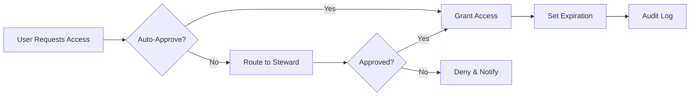

## What is Data Governance?

Data governance is the framework of policies, procedures, and controls that ensure data is managed as a strategic asset. AVA automates and streamlines data governance across your entire organization, from discovery to enforcement.

<CardGroup cols={3}>
  <Card title="Discovery" icon="magnifying-glass">
    Automatically find and catalog all data assets
  </Card>
  <Card title="Classification" icon="tags">
    AI-powered identification of sensitive data
  </Card>
  <Card title="Policy Enforcement" icon="shield-check">
    Automated enforcement of governance rules
  </Card>
</CardGroup>

## Key Components

### Data Discovery & Cataloging

AVA continuously discovers and catalogs data across your organization:

<Steps>
  <Step title="Automated Discovery">
    Scans connected data sources to identify all data assets
  </Step>
  <Step title="Metadata Extraction">
    Captures schemas, relationships, and technical metadata
  </Step>
  <Step title="Business Context">
    Enriches technical metadata with business context
  </Step>
  <Step title="Lineage Mapping">
    Traces data flow from source to consumption
  </Step>
</Steps>

### Data Classification

Intelligent classification of sensitive data:

<Tabs>
  <Tab title="Automatic Classification">
    AVA's AI engine automatically identifies:
    - **Personal Identifiable Information (PII)**: Names, emails, SSN
    - **Protected Health Information (PHI)**: Medical records, patient data
    - **Financial Data**: Credit cards, bank accounts, tax information
    - **Credentials**: API keys, passwords, tokens
    - **Proprietary Data**: Trade secrets, confidential business data
  </Tab>

  <Tab title="Custom Classifications">
    Define organization-specific classifications:
    ```bash
    ava classifications create \
      --name "Customer Loyalty Data" \
      --sensitivity "high" \
      --patterns "loyalty_id,rewards_points,member_tier" \
      --description "Customer loyalty program information"
    ```
  </Tab>

  <Tab title="ML-Based Classification">
    Train custom models for specialized data:
    ```python
    from ava import Client

    client = Client(api_key="YOUR_API_KEY")

    # Train classification model
    model = client.ml.train_classifier(
        name="Contract Documents",
        training_data="path/to/labeled/contracts",
        features=["content", "metadata", "structure"]
    )

    # Apply to data sources
    client.classifications.apply_model(
        model_id=model.id,
        sources=["sharepoint", "documentum"]
    )
    ```
  </Tab>
</Tabs>

### Policy Management

Create and enforce data governance policies:

```yaml
# Example: PII Protection Policy
name: PII Protection Policy
description: Ensure PII is properly protected
scope:
  classifications:
    - PII
    - PII_EMAIL
    - PII_SSN
rules:
  - name: Encryption Required
    type: encryption
    required: true
    algorithm: AES-256

  - name: Access Control
    type: access
    allowed_roles:
      - data-steward
      - compliance-officer
      - administrator
    require_mfa: true

  - name: Retention Policy
    type: retention
    period: 7 years
    after_period: anonymize

  - name: Audit Logging
    type: audit
    log_all_access: true
    alert_on_bulk_export: true

enforcement:
  mode: strict  # block | warn | audit
  exceptions_require_approval: true
  auto_remediate: true
```

### Access Controls

Comprehensive access management:

<AccordionGroup>
  <Accordion title="Role-Based Access Control (RBAC)">
    Define roles and assign permissions:
    ```bash
    # Create custom role
    ava roles create "Finance Data Analyst" \
      --permissions "data:read:finance_*,reports:create" \
      --data-sources "snowflake_finance,tableau_finance"
    ```
  </Accordion>

  <Accordion title="Attribute-Based Access (ABAC)">
    Dynamic access based on attributes:
    ```yaml
    policy:
      name: Regional Data Access
      conditions:
        - user.region == data.region
        - user.department == "Sales"
        - data.classification != "RESTRICTED"
      actions:
        - read
        - query
    ```
  </Accordion>

  <Accordion title="Just-In-Time Access">
    Temporary elevated permissions:
    ```bash
    # Grant time-limited access
    ava access grant \
      --user john@company.com \
      --resource customer_database \
      --duration 4h \
      --reason "Support ticket #12345"
    ```
  </Accordion>

  <Accordion title="Data Masking">
    Protect sensitive data in non-production:
    ```bash
    # Configure masking rules
    ava masking create-rule \
      --source snowflake_prod \
      --table customers \
      --column email \
      --mask-type email \
      --apply-to-environments "dev,test"
    ```
  </Accordion>
</AccordionGroup>

## Governance Workflows

### Data Stewardship Workflow

<Steps>
  <Step title="Asset Discovery">
    AVA discovers new or changed data assets
  </Step>
  <Step title="Automated Classification">
    AI classifies data and assigns initial risk scores
  </Step>
  <Step title="Steward Review">
    Data steward reviews and validates classifications
  </Step>
  <Step title="Policy Application">
    Appropriate policies are automatically applied
  </Step>
  <Step title="Continuous Monitoring">
    AVA monitors compliance and alerts on violations
  </Step>
</Steps>

### Access Request Workflow



### Data Quality Management

Monitor and improve data quality:

<Tabs>
  <Tab title="Quality Rules">
    ```bash
    # Create quality rule
    ava quality create-rule \
      --name "Email Validation" \
      --source salesforce \
      --table Contact \
      --column Email \
      --type "regex" \
      --pattern "^[a-zA-Z0-9._%+-]+@[a-zA-Z0-9.-]+\.[a-zA-Z]{2,}$" \
      --severity "high"
    ```
  </Tab>

  <Tab title="Quality Metrics">
    ```python
    # Monitor data quality
    quality_report = client.quality.get_report(
        source="salesforce",
        metrics=["completeness", "accuracy", "consistency"]
    )

    print(f"Completeness: {quality_report.completeness}%")
    print(f"Issues: {quality_report.issues_count}")
    ```
  </Tab>

  <Tab title="Auto-Remediation">
    ```yaml
    remediation_rules:
      - name: Fix Missing Emails
        trigger:
          metric: completeness
          threshold: 95%
        action:
          type: notify
          recipients:
            - data-steward@company.com

      - name: Standardize Phone Numbers
        trigger:
          metric: consistency
          field: phone
        action:
          type: transform
          function: standardize_phone
    ```
  </Tab>
</Tabs>

## Governance Maturity Model

Track your governance maturity:

<Steps>
  <Step title="Level 1: Initial">
    - Manual discovery
    - Ad-hoc policies
    - Reactive approach
  </Step>
  <Step title="Level 2: Developing">
    - Automated discovery
    - Basic classifications
    - Some policies defined
  </Step>
  <Step title="Level 3: Established">
    - Comprehensive catalog
    - Consistent classification
    - Policies enforced
  </Step>
  <Step title="Level 4: Managed">
    - Proactive monitoring
    - Automated workflows
    - KPI tracking
  </Step>
  <Step title="Level 5: Optimized">
    - Continuous improvement
    - AI-driven insights
    - Business value focus
  </Step>
</Steps>

```bash
# Assess governance maturity
ava governance assess-maturity --generate-roadmap
```

## Best Practices

<CardGroup cols={2}>
  <Card title="Start with Discovery" icon="magnifying-glass">
    Understand what data you have before governing it
  </Card>
  <Card title="Classify Incrementally" icon="layer-group">
    Begin with most sensitive data, expand gradually
  </Card>
  <Card title="Automate Where Possible" icon="robot">
    Reduce manual effort and human error
  </Card>
  <Card title="Define Clear Ownership" icon="user-check">
    Assign data owners and stewards
  </Card>
  <Card title="Measure Continuously" icon="chart-line">
    Track KPIs and governance metrics
  </Card>
  <Card title="Educate Users" icon="graduation-cap">
    Train teams on governance policies
  </Card>
</CardGroup>

## Key Metrics

Monitor these governance KPIs:

<Tabs>
  <Tab title="Coverage Metrics">
    - **Catalog Completeness**: % of data sources cataloged
    - **Classification Coverage**: % of data classified
    - **Policy Coverage**: % of data covered by policies
    - **Lineage Coverage**: % of data with documented lineage
  </Tab>

  <Tab title="Compliance Metrics">
    - **Policy Violations**: Number of active violations
    - **Remediation Time**: Average time to resolve violations
    - **Compliance Score**: Overall compliance percentage
    - **Audit Readiness**: % of audit requirements met
  </Tab>

  <Tab title="Quality Metrics">
    - **Data Quality Score**: Overall quality rating
    - **Completeness**: % of required fields populated
    - **Accuracy**: % of data meeting validation rules
    - **Timeliness**: % of data updated within SLA
  </Tab>

  <Tab title="Access Metrics">
    - **Access Reviews**: % completed on time
    - **Privileged Access**: Number of users with elevated access
    - **Access Violations**: Unauthorized access attempts
    - **Request Processing Time**: Average approval time
  </Tab>
</Tabs>

## Common Challenges

<AccordionGroup>
  <Accordion title="Data Sprawl">
    **Challenge**: Data exists across hundreds of systems

    **Solution**:
    - Use AVA's automated discovery
    - Prioritize by risk and sensitivity
    - Implement federated governance model
  </Accordion>

  <Accordion title="Shadow IT">
    **Challenge**: Ungoverned data in unsanctioned tools

    **Solution**:
    - Monitor for new data sources
    - Implement approval workflows
    - Educate on risks and alternatives
  </Accordion>

  <Accordion title="Classification Accuracy">
    **Challenge**: False positives/negatives in classification

    **Solution**:
    - Train custom ML models
    - Implement steward review process
    - Continuously refine rules
  </Accordion>

  <Accordion title="User Adoption">
    **Challenge**: Users circumvent governance controls

    **Solution**:
    - Make compliance easy
    - Provide self-service options
    - Demonstrate business value
  </Accordion>
</AccordionGroup>

## Integration with Other Tools

AVA integrates with your existing governance ecosystem:

```python
# Sync with external catalog
client.integrations.sync_catalog(
    source="collibra",
    direction="bidirectional",
    entities=["assets", "terms", "policies"]
)

# Export to GRC platform
client.integrations.export_compliance(
    destination="servicenow_grc",
    frameworks=["GDPR", "SOC2"],
    format="controls_mapping"
)
```

## Governance Reports

Generate comprehensive governance reports:

```bash
# Executive summary
ava reports generate governance-summary \
  --period monthly \
  --output executive-report.pdf

# Detailed catalog report
ava reports generate catalog-report \
  --include-lineage \
  --include-classifications \
  --format excel

# Compliance dashboard
ava reports generate compliance-dashboard \
  --frameworks "GDPR,CCPA,SOC2" \
  --format html
```

## Next Steps

<CardGroup cols={2}>
  <Card
    title="Access Controls"
    icon="key"
    href="/guides/data-governance/access-controls"
  >
    Implement fine-grained access controls
  </Card>
  <Card
    title="Compliance Tracking"
    icon="clipboard-check"
    href="/guides/data-governance/compliance-tracking"
  >
    Monitor and report on compliance
  </Card>
  <Card
    title="Audit Logs"
    icon="list-check"
    href="/guides/data-governance/audit-logs"
  >
    Track all governance activities
  </Card>
  <Card
    title="Risk Management"
    icon="triangle-exclamation"
    href="/guides/risk-management/overview"
  >
    Assess and manage data risks
  </Card>
</CardGroup>
